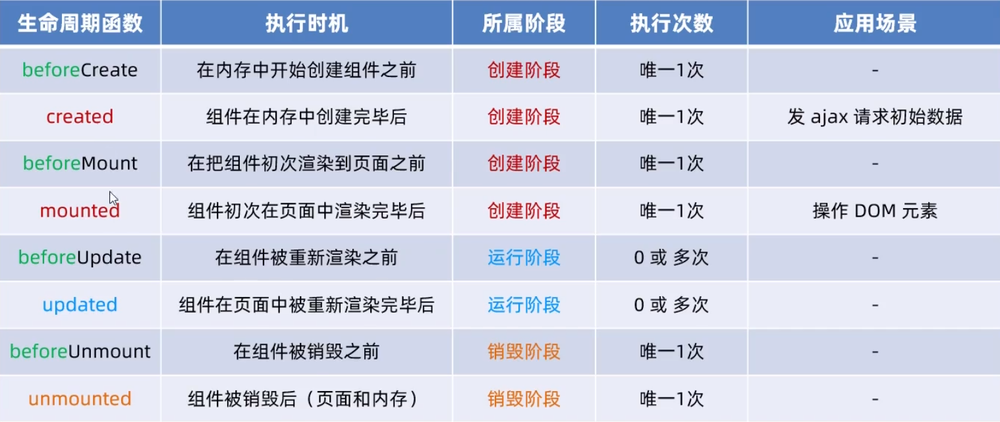
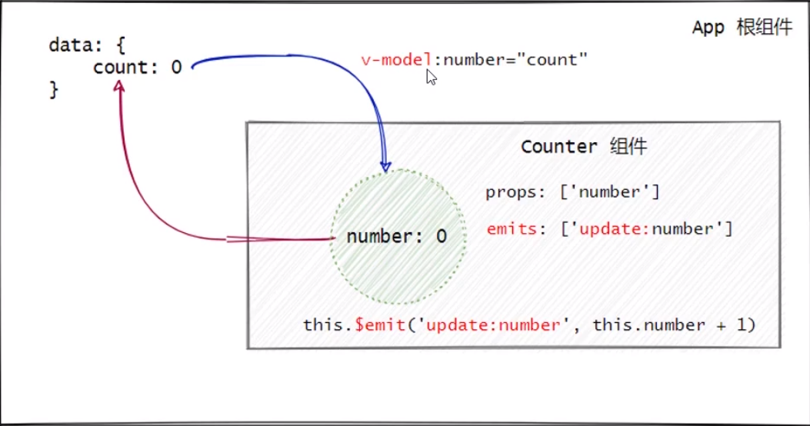
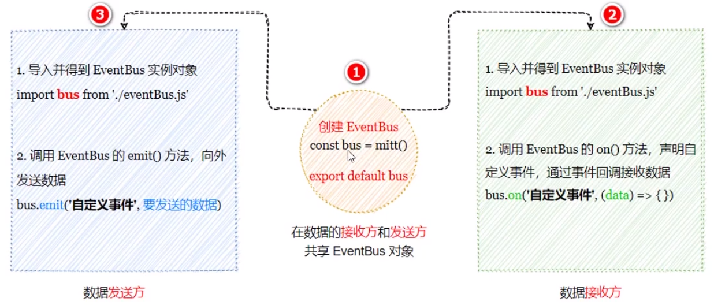

# 组件高级

- [组件高级](#组件高级)
  - [1 watch](#1-watch)
    - [`immediate`选项](#immediate选项)
    - [`deep`选项](#deep选项)
    - [只监听单个属性](#只监听单个属性)
  - [组件中的生命周期函数](#组件中的生命周期函数)
  - [组件共享数据](#组件共享数据)
    - [1 父子组件](#1-父子组件)
      - [a 父->子](#a-父-子)
      - [b 子->父](#b-子-父)
      - [c 父子双向同步数据](#c-父子双向同步数据)
    - [2 兄弟组件](#2-兄弟组件)
    - [3 后代关系](#3-后代关系)
      - [响应式数据](#响应式数据)
    - [4 vuex](#4-vuex)
  - [全局配置axios](#全局配置axios)
  - [拿到dom对象](#拿到dom对象)
  - [动态渲染组件](#动态渲染组件)
  - [插槽](#插槽)
    - [后备内容](#后备内容)
    - [具名插槽](#具名插槽)
    - [作用域插槽](#作用域插槽)
  - [自定义指令](#自定义指令)
    - [私有自定义指令](#私有自定义指令)
    - [全局自定义指令](#全局自定义指令)

## 1 watch

### `immediate`选项

> 当组件初次加载完毕之后立即调用watch侦听器

### `deep`选项

> 如果想要侦听的对象内属性的变化，增加deep选项

### 只监听单个属性

```js
watch:{
    'info.username'{
        // handler固定用法，当username变化时调用handler
        async handler(newVal) {
            const { data: res } = await axios.get(
          `https://www.escook.cn/api/finduser/${newVal}`
        );
        console.log(res);
      },
    }
}
```

## 组件中的生命周期函数

| 生命周期函数 |           执行时机           | 所属阶段 | 执行次数 |      应用场景      |
|:------------:|:----------------------------:|:--------:|:--------:|:------------------:|
|  `created`   |   组件在内存中创建完毕之后   | 创建阶段 | 唯一1次  | 发ajax请求初始数据 |
|  `mounted`   |   组件初次在页面中渲染完毕   | 创建阶段 | 唯一1次  |    操作Dom元素     |
| `unmounted`  | 组件被销毁之后（页面or内存） | 销毁阶段 | 唯一1次  |         -          |
|  `updated`   |   组件在页面中重新渲染完毕   | 运行阶段 | 0或多次  |         -          |



## 组件共享数据

### 1 父子组件

#### a 父->子

- 父组件通过`v-bind`属性绑定想子组件共享数据。子组件通过props接收数据

#### b 子->父

- 子组件通过自定义事件（`emits`）的方式向父组件共享数据

- 父组件通过`v-on`接收数据

#### c 父子双向同步数据

`v-model`



### 2 兄弟组件

方案是`EventBus`方法，借助第三方包mitt创建eventBus对象来实现数据共享。



### 3 后代关系

父节点发送数据`provide`方法（和data平级）

```js
export default {
    provide() {
        return{
            color: this.color
        }
    }
}
```

接收数据`inject`

```js
export default {
    inject:['color']
}
```

访问的时候:`{{color}}`

#### 响应式数据

```js
import {compputed} from 'vue'

export default {
    data() {
        return {
            color:'red'
        }
    },
    provide() {
        return{
            color: computed(() => this.color)
        }
    }
}`
```

访问的时候调用`{{color.value}}`

### 4 vuex

帮助程序员管理需要共享的数据

## 全局配置axios

main.js：`app.config.globalPropwerties`

## 拿到dom对象

注册`ref`

如果组件还未生成那么需要用到

```js
this.nextTick(()=>{
  this.$ref.name.foces()
})
```

## 动态渲染组件

```js
<keep-alive>
  <component :is="comName"></component>
</keep-alive>

```

## 插槽

Slot 

### 后备内容

如果用户没有指定插槽内的内容，那么就会启用后备内容

```js
<slot>这里放后备内容</slot>
```

### 具名插槽

如果有多个插槽，那么就为每个插槽提供具体的名称来区分

```js
<slot name="name1">这里放后备内容</slot>
```

**使用方式：**

```js
<my-artical>
  <template v-slot:name1> <!--可以简写成#name1 -->
    <h1>name1插槽中的内容</h1>
  </template>
</my-artical>
```

### 作用域插槽

包裹的东西可以绑定Props

## 自定义指令

### 私有自定义指令

### 全局自定义指令

```js
// 生命全局自定义属性
app.directive('focus', {
    mounted(el) {
        el.focus()
    },
    updated(el) {
        el.focus()
    }
})
```

如果updated和mounted函数内容一样，就可以简写：

```js
app.directive('focus', (el)=>{
    el.focus()
})
```

