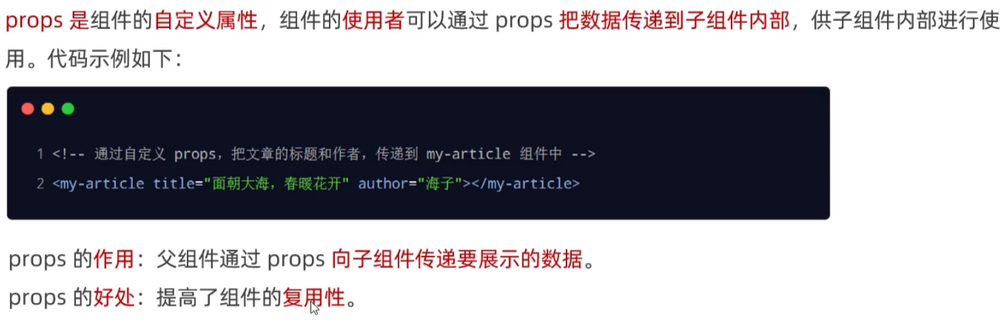
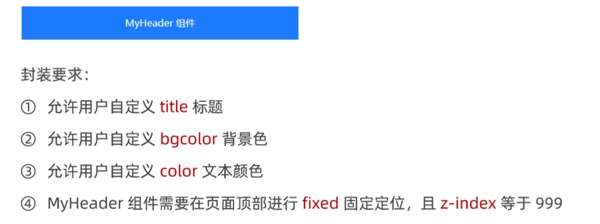
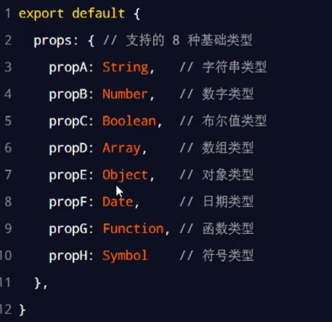

# vue

## 全局注册组件

在main.js里面导入组件，使用`app.component`进行绑定

```js
import Swiper from './components/globalReg/Swiper.vue'
import Test from './components/globalReg/Test.vue'


const app = createApp(App)

// 调用app.component全局注册组件
app.component('my-swiper', Swiper)
app.component('my-test', Test)
```

## 局部注册组件

在想要使用的组件位置使用：

```js
<template>
    <my-swiper></my-swiper>
</template>
import Swiper from ...
export default {
    components: {
        'my-swiper':Swiper
    }
}
```

### 父组件的样式对子组件样式的穿透

```js
/deep/ .title{
    color:blue
}
```

### 组件的props



```js
export default {
    props:["title", 'author']
}
```

## 案例

### MyHeader



## props校验

### 1 指定输入属性

```js
export default {
    props:{
        title:String,
        author:Number
    }
}
```

<div style="text-align: center;">
    
</div>

<!--  -->

是否是必填项：`required: true`

默认值:`default: 100`

## 自定义事件

### 生命自定义事件

### 触发自定义事件

通过emits定义，`this.$emits('自定义事件名称')`方法触发

```js
emits:['change']
methods: {
    onBtnClicked() {
        this.$emits('change')
    }
},
```

### 监听自定义事件

`@change="getCount"`
